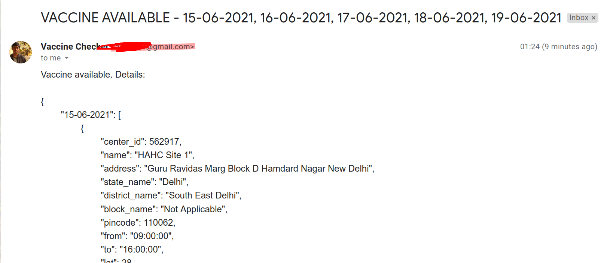

# VaccineNotifier  🇮🇳
VaccineNotifier checks the cowin portal to find vaccination slots available in your pin code and for your age. If found, it will send you an email with all found available slot details.

Step 1) Enable application access on your gmail with steps given here:
https://support.google.com/accounts/answer/185833?p=InvalidSecondFactor&visit_id=637554658548216477-2576856839&rd=1  
\
Step 2) Enter the details in the file .env, present in the same folder
\
Step 3) Install dependencies; And run: `node vaccineNotifier.js`
\

Here's a sample of the resultant emails:

## Changes from original repository

1. Send single email with all dates, vaccine are available (How many days, you can control, change the number in fetchNDays(7))

2. Free vaccine - Just change IS\_FREE to false, if you also want to look for paid vaccines. By default it looks for free vaccines

3. NOT using node's cronjob and pm2. Since the API is severly limited now.
   You may run it manually, since it gives result for many days at a time
   Personally, I setup a cron-job on Linux, to run it daily.

4. Minor dependency change - Removed axios (Replaced with node-fetch), moment, pm2, cronjob, node-cron dependencies

